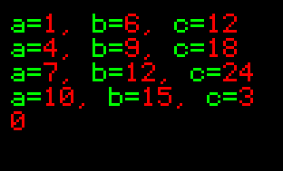
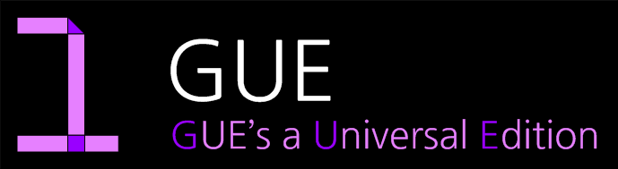

# Design Your Style, Starlit

## The Programming Language For Embedded Devices
- Starlit은 임베디드의 Flash Memory(MicroSD카드 또는 자체 Flash Memory 등)에 바이너리 저장해서 임베디드 내의 Virtual Machine을 실행해 작동하는 프로그래밍 언어입니다. 임베디드를 더욱 효율적으로 디자인할 수 있습니다.

## News

- Starlit 4.0 새로운 기능??
  ```
  ///IS IT Possible?
  main
      OLED << "Hello, World!"
      while !BUTTON_Read()
  ```
  - Starlit 4.0 문법, 확 달라지나...?
  

- Starlit 3.4? 4.0?

  - for문의 혁명! 그리고 자유로운 전역변수!
    ```
    $import(oled);
    OLED = OLED_Black();
    
    
    main(){
        for(a:1:3:10; b=a+5, c=b*2){
            OLED << f"/ga=/r{a}, /gb=/r{b}, /gc=/r{c}" << "\n";
        }
    
        while(!BUTTON_Read()){}
    }
    ```
    

- Starlit 3.3 업데이트사항

  - f-String 기능 추가
  - 배열 대입 기능 추가
  - Call-By-Reference와 Return-By-Reference 관련 이슈 해결
  - 단항 연산자 개선
  - 객체의 멤버변수를 통해 함수 실행하는 기능 추가
  - GUE 언어 라이브러리 패치되지 않아 실행되지 않은 오류 수정



- `그(GUE)` 프로그래밍 언어가 추가되었습니다.
- Starlit의 초창기 시절을 재구성하여 만들었습니다.
- 로고는 한글 `그`와 동시에 Starlit 언어의 초창기를 의미하는 숫자 `1`을 상징합니다.


## Documents(Starlit 3.2)

| No. | Docs |
|-----|------|
|0|[튜토리얼](https://github.com/PJungKim/Starlit3/blob/main/docs/000_Tutorial.md)|
|1|[Hello, World! 출력하기](https://github.com/PJungKim/Starlit3/blob/main/docs/001_Hello_World.md)|
|2|[글자색, 글자크기 조절하기](https://github.com/PJungKim/Starlit3/blob/main/docs%2F002_Color_Size.md)|
|3|[변수 사용하기](https://github.com/PJungKim/Starlit3/blob/main/docs/003_Button_Var.md)|
|4|[조건문](https://github.com/PJungKim/Starlit3/blob/main/docs%2F004_condition.md)|
|5|반복문|

## Documents(GUE)

|No.|Docs|
|---|----|
|0|튜토리얼+ `Hello, World!`|
|1|변수 사용하기|
|2|조건문|
|3|반복문|

## History of Issues

### 2024. 04

- 30 Starlit 3.2 Update
  - Added Call_by_ref and ref_based_variable
  - Simple Variable Definition
  - SI-Unit for Float Literal
  - Fixed some string bugs.
- 04 Fixed Windows11 API Issue(Virtual Machine Only)
- 01 Starlit 3.1 Release
