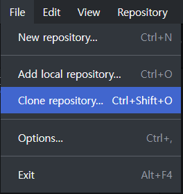
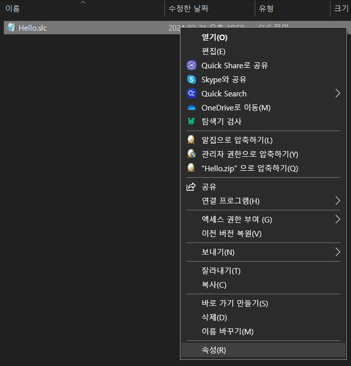
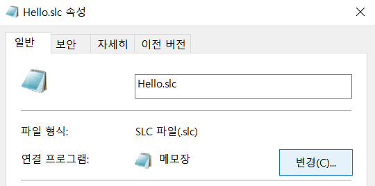
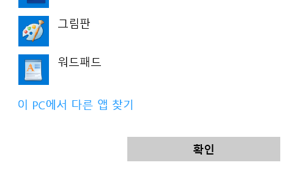
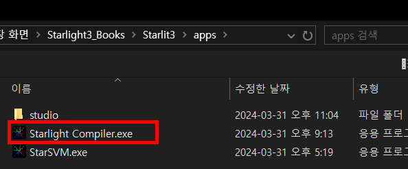
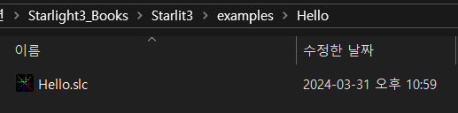
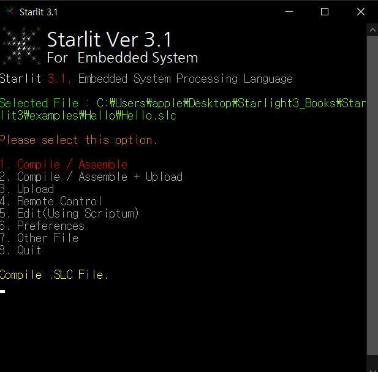
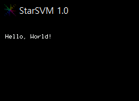

# Tutorials

## 1. Starlit 받기

### 1.1. Starlit 링크 복사하기

- 우선, GitHub에 들어오셨으면 `Code` - `Clone`에 있는, `복사` 버튼을 눌러 링크를 복사해주세요.
- 이 페이지에 들어오셨다면 Starlit3 홈으로 가셔서 연두색 `code`를 눌러 주시면 됩니다.

  

### 1.2. 레포지토리 당겨오기

- GitHub Desktop에 들어가셔서 `File` - `Clone Repository`를 선택해 주세요.

  
  
- 그 다음에 `URL`을 선택하셔서 복사한 링크를 붙인 다음, `Choose`를 선택하셔서 Starlit을 설치할 위치를 선택해 주세요.
  - *주의 : 주소에는 `_`를 제외한 모든 특수문자, 한글, 띄어쓰기 등이 없어야 합니다.*

- 그런 다음에 `Clone`을 선택하시면 Starlit 설치가 완료됩니다.

  

## 2. Scriptum 받기

- Starlit의 개발환경은 HDL Works에서 제작한 [Scriptum](https://www.hdlworks.com/downloads/scriptum_soft.html)을 사용합니다. 따라서 Scriptum을 설치하시고, 서식 파일을 아래와 같이 패치해주세요.

### 2.1. Scriptum 설치
- 앞의 [링크](https://www.hdlworks.com/downloads/scriptum_soft.html)를 타고 운영체제에 맞게 설치해 주시면 됩니다.

### 2.2. xml 파일 패치
- C:\Program files\HDL WORKS\

## 3. 테스트 해보기
- 처음에 테스트를 위한 예제를 1개 제공합니다.

- Examples 폴더의 Hello_world 폴더에 들어가신 후 Hello.slc 파일을 우클릭하신 후 속성에 들어갑니다.

  

- 연결 프로그램을 다운받으신 주소의 apps 폴더에 들어간 후 starlight compiler.exe로 설정해 주세요.

  - 우선 연결 프로그램에 있는 `변경`을 누릅니다.

    

  - 그 다음, 더 보기를 눌러서 맨 아래로 내려간 다음 `이 PC에서 다른 앱 찾기`를 선택해주세요.

    
 
  - Starlit 설치 폴더에 들어가서 `apps`에 있는 `Starlight Compiler.exe`를 선택합니다.

    

  - 선택했으면 `적용`을 선택한 후 `확인`을 눌러주세요. 아래 그림과 같이 Starlit 로고로 바뀌면 됩니다. 이제, 이 파일을 더블클릭해서 실행합니다.
 
    

- 그 다음, 키보드의 1번을 누르고 Enter를 선택합니다.

  

- 컴파일이 진행되고, SVM이 실행됩니다. 예제 파일인 경우 흰색 글자로 조그만한 글자로 `Hello, World!`가 출력되면 됩니다.

  

## 4. 여담

- 현재 Windows 11에서는 실행이 되지 않는 것으로 파악됩니다. ~~Windows 11은 Pspice도 안돌아간다고 하니 참 골때리긴 합니다...~~
